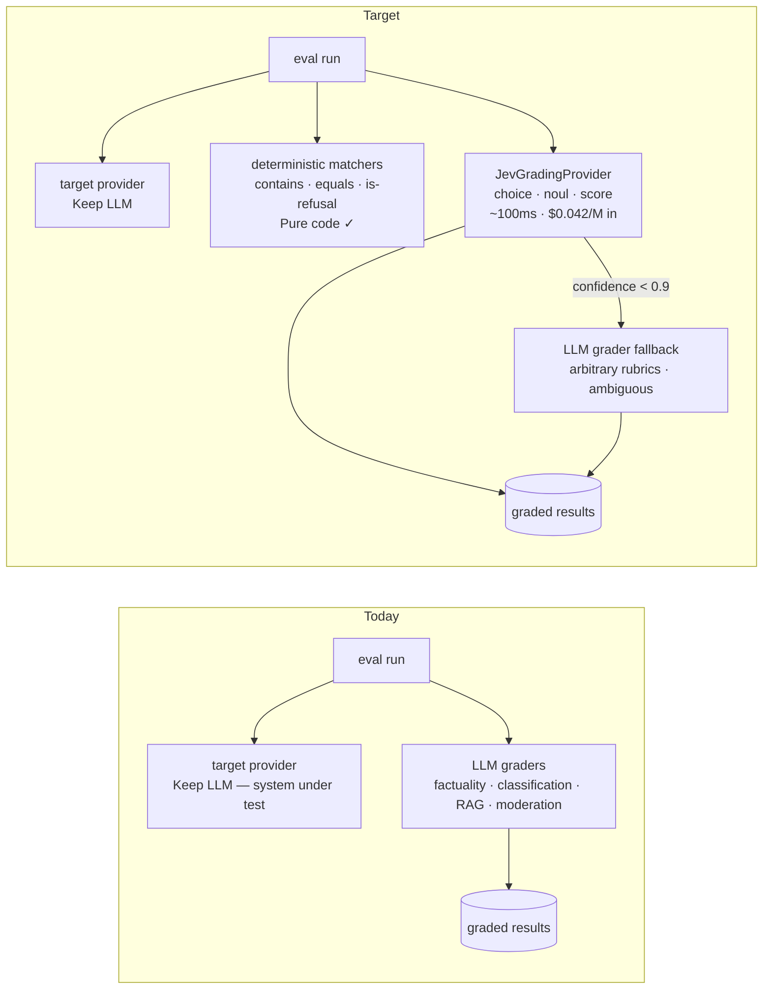

# Jev Audit — promptfoo

> Which LLM calls in this codebase are actually decisions, and what would they look like on Jev?
> Generated 2026-09-19 · Scanner hits: 4,243 (3,792 files) · Call sites reviewed: 11 key grader/matcher sites · Analysis by the coding agent using **jev-audit**

**Target:** [promptfoo/promptfoo](https://github.com/promptfoo/promptfoo) @ commit `32b79fd` — the popular open-source LLM eval & red-teaming framework.
**Disclaimer:** independent illustration by the jev-audit authors. Not affiliated with promptfoo or TypeSafe AI. Costs are estimates from static analysis. Jev facts from [docs.typesafe.ai](https://docs.typesafe.ai) as of 2026-09.

## 1. Executive summary

- LLM touchpoints found: **4,243** across 3,792 files — dominated by tests (mocked calls), the provider adapters themselves (the system under test), and example configs. The interesting surface is small: **~10 grader/matcher modules** in `src/matchers/` and `src/assertions/`.
- Of the grading call sites reviewed: **5 can move to Jev now** (Replace), **2 split into decide + generate** (Hybrid), **2 should stay on the LLM**, **1 is already pure code**.
- The punchline: **the eval framework's own graders are decisions wearing a generator's clothes.** Factuality checks parse an LLM's JSON back into a 5-option verdict; classification thresholds a probability the model had internally; RAG graders ask yes/no per chunk. These are exactly Jev's `choice` / `noul` / `score` primitives — at ~$0.025 per 1,000 grading calls instead of ~$0.14–$2.30, and ~100 ms instead of seconds.
- Best quick win: `src/matchers/llmGrading.ts:323` (`matchesFactuality`) — leaf grader, fixed 5-option output space, existing JSON-parse + legacy-regex-fallback cruft disappears entirely.

## 2. Inventory (key call sites)

| # | Location | SDK / model | Job of the call | Tier |
|---|---|---|---|---|
| 1 | `src/matchers/llmGrading.ts:323` | grading provider (any LLM) | Factuality verdict: pick one of 5 fixed options + reason | **Replace** |
| 2 | `src/matchers/classification.ts:14` | classification provider | Label text; compare score to threshold | **Replace** |
| 3 | `src/matchers/rag.ts:260` | grading provider | Per-chunk "is this relevant?" judgment | **Replace** |
| 4 | `src/matchers/rag.ts:146` | grading provider | Per-sentence "is this attributable to context?" | **Replace** |
| 5 | `src/matchers/rag.ts:385` | grading provider | Faithfulness verdicts on answer vs context | **Replace** |
| 6 | `src/matchers/moderation.ts:22` | moderation provider (e.g. Llama Guard) | Category flags + scores for harm | **Replace** |
| 7 | `src/matchers/llmGrading.ts:181` | grading provider | Arbitrary user-authored rubric → PASS/FAIL | **Hybrid** |
| 8 | `src/guardrails.ts:36` | remote promptfoo cloud API | Moderation categories + PII entities | **Hybrid** (server-side) |
| 9 | `src/providers/**` (e.g. `openai/chat.ts`) | all major SDKs | Calling the model **under test** | **Keep LLM** |
| 10 | `src/redteam/**` (strategy plugins) | grader/target LLMs | Synthesizing adversarial attack prompts | **Keep LLM** |
| 11 | `src/assertions/refusal.ts:11` | none — `isBasicRefusal` regex | Detect refusals | **Pure code** ✓ |

Volumes: grading calls scale with `assertions × test cases × prompts` in every eval run — unknown per-user, so all savings below are **per 1,000 grading calls**.

## 3. Tier detail

### 3.1 Replace — move to Jev now

#### #1 `matchesFactuality` — `src/matchers/llmGrading.ts:323`

Today: renders `PROMPTFOO_FACTUALITY_PROMPT` with `{input, ideal, completion}`, calls the grading LLM, then `parseFactualityJsonResponse` on free text — with a **fallback to legacy pattern matching** when the JSON doesn't parse. That fallback is the tell: the code only needs one of five fixed verdicts, and the LLM only offers them probabilistically.

```json
{
  "model": "jev-latest",
  "state": {
    "input": "<original question>",
    "ideal": "<ground-truth answer>",
    "completion": "<output under test>"
  },
  "questions": {
    "factuality": {
      "type": "choice",
      "instructions": "Select the verdict describing how `completion` relates to `ideal`",
      "criteria": {
        "subset": "Submission has some correct content but omits part of the ideal answer",
        "correct": "Submission matches the ideal answer in substance",
        "superset": "Submission is correct but includes extra unsupported content",
        "different": "Submission differs materially from the ideal answer",
        "incorrect": "Submission contradicts the ideal answer"
      }
    }
  }
}
```

Confidence plan: `confidence ≥ 0.9` → count the verdict · `< 0.9` → fall through to the LLM grader (keeps existing behavior for ambiguous cases). The JSON-parse and regex-fallback paths are deleted, not migrated.

#### #2 `matchesClassification` — `src/matchers/classification.ts:14`

Already shaped like a decision: `callClassificationApi` returns label → scores, code thresholds them. Jev's `choice` returns the full `probabilities` distribution natively — the threshold logic ports line-for-line, and probabilities are calibrated (a 0.9 answer is right ~90% of the time). This is TypeSafe's own "classification at scale" cookbook shape.

#### #3–#5 RAG graders — `src/matchers/rag.ts:146,260,385`

All three decompose into per-unit yes/no judgments ("is this chunk relevant?", "is this sentence attributable?") that the current implementation extracts from generated prose. On Jev: one call per eval step, all chunk-level `noul` questions fanned out in a single request (questions run in parallel; cost is input tokens only, output is free — a fan-out of N chunks ≈ the price of one LLM chunk grading). Maps 1:1 to TypeSafe's `classifying_rag_passages` cookbook.

#### #6 `matchesModeration` — `src/matchers/moderation.ts:22`

Harm categories are a fixed option set with per-category scores → `choice` per category family or `score` for severity levels. Guardrail decisions are the canonical "branch in code, never prose" case.

### 3.2 Hybrid — Jev decides, LLM generates

#### #7 `matchesLlmRubric` — `src/matchers/llmGrading.ts:181`

Fixed rubrics ("polite, under 50 words, no PII") decompose into atomic Jev `noul`/`score` questions with code-combined results — and when the rubric wording changes, you re-ask the same typed questions. **Arbitrary user-authored rubric prompts keep the LLM** — a user's free-text rubric with custom `rubricPrompt` is genuine language understanding. Route: rubric has fixed criteria → Jev; custom rubric prompt configured → LLM.

#### #8 `guardrails.ts:36` — remote moderation client

The decision shape is perfect (`flagged`, category booleans, PII spans), but the LLM/moderation call happens inside promptfoo's cloud service — the swap happens server-side, out of this repo's reach. Noted for the platform team.

### 3.3 Keep on LLM

- **`src/providers/**`** — these calls *are* the product: promptfoo exists to exercise real LLMs under test. Replacing them with Jev would be testing the wrong thing.
- **Red-team strategy generation** — synthesizing novel adversarial prompts is creative generation, Jev's hardest non-case.

### 3.4 Pure code — already right

- **`is-refusal`** (`src/assertions/refusal.ts:11`) already uses `isBasicRefusal` regex + empty-string checks. Correct call: an if that costs nothing beats a model. *Optional* upgrade: paraphrased soft-refusals ("I'm not able to help with that") slip past keyword matching — a `noul` fallback for the ~borderline cases would tighten it without regressing the fast path.

### 3.5 Needs human judgment

- **Pi scoring / remote graders** (`matchesPiScore`, `doRemoteGrading`): grading delegated to external services; same decision-shaped pattern but the LLM boundary is remote.
- **`select-best` / `answer-relevance`** matchers: not deep-read in this pass; likely `choice`-shaped but verify against the rubric prompts before claiming.

## 4. Target architecture

The migration seam already exists — promptfoo's own provider registry. Graders resolve providers via `getAndCheckProvider(...)` and call `callApi` / `callClassificationApi` / `callModerationApi`; a Jev-backed implementation slots in behind that interface with **zero changes to grader logic**:



Confidence gating keeps the LLM grader as the escalation path rather than the default — identical failure semantics to today, at a fraction of the cost, with `confidence` exposed as a first-class signal an eval framework is uniquely positioned to use.

## 5. Savings estimate (factuality grader, per 1,000 grading calls)

| Grader backend | In tok | Out tok | Cost / 1K calls | Latency/call |
|---|---|---|---|---|
| gpt-4o class ($2.50/M in, $10/M out) | 600 | 80 | **$2.30** | 1–4 s |
| gpt-4o-mini class ($0.15/M in, $0.60/M out) | 600 | 80 | **$0.14** | 1–4 s |
| Jev ($0.042/M in, output free) | 600 | 0 | **$0.025** | ~100 ms |

Assumptions: ~600-token rubric prompt, ~80-token JSON reply (typical for this grader), list prices 2026-09. Savings: **~82–99% on cost and ~95% on latency** for the Replace tier, scaling with `assertions × cases × prompts` per run. RAG graders gain more: N chunk judgments collapse into one fan-out call. **Estimates from static analysis — validate against real grading logs before budgeting.**

## 6. Migration order

1. **`matchesFactuality`** behind a `JevGradingProvider` (fixed 5-option space, leaf call site, LLM fallback = existing grader). Shadow-run both, diff verdicts on real eval sets.
2. **RAG graders** (`rag.ts`) — highest fan-out win.
3. **`matchesClassification`** — interface already matches (`probabilities` + threshold).
4. **`matchesModeration`**, then rubric routing (`fixed criteria → Jev`).
5. Rollback at every step = flip the grading provider back; the LLM path is never deleted.

---

*Audit generated with **jev-audit** — find the decisions hiding in your LLM bill: `npx jev-audit`*
